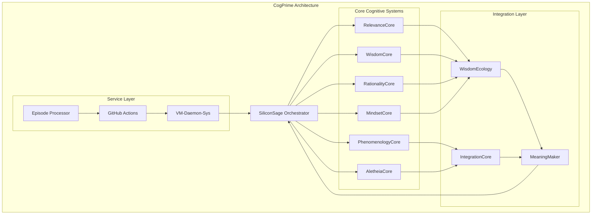
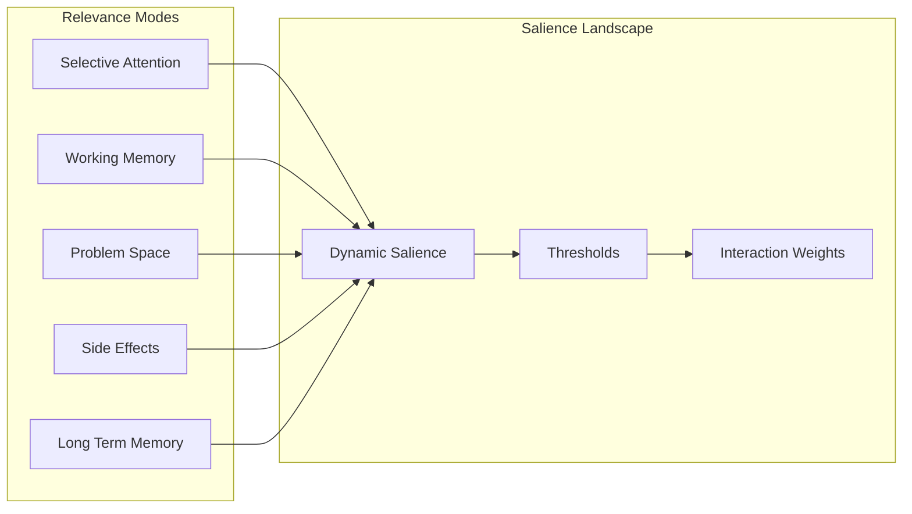
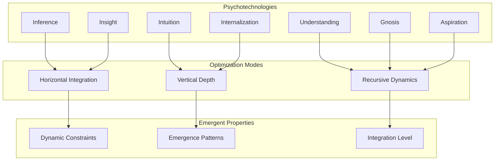

# CogPrime: An Integrative Architecture for Embodied Artificial General Intelligence

CogPrime is a cognitive architecture project inspired by John Vervaeke's "Awakening from the Meaning Crisis" lecture series and research on relevance realization, wisdom, and cognitive science. It implements a comprehensive framework for artificial general intelligence based on cognitive science principles and contemplative practices.

## Overview

This project integrates multiple cognitive frameworks to create a unified system capable of:

- **Relevance Realization**: Dynamic attention and salience management
- **Wisdom Ecology**: Integrated psychotechnologies for optimal cognition  
- **Rational and Contemplative Practices**: Evidence-based reasoning and mindfulness
- **Phenomenological Depth**: Rich experiential processing and meaning-making
- **Service Orchestration**: Distributed cognitive service management via vm-daemon-sys

## Core Architecture

The CogPrime architecture is built around several interconnected cognitive cores that work together to create intelligent, adaptive behavior:



## Cognitive Framework Components

### 1. Relevance Realization System

The RelevanceCore implements Vervaeke's relevance realization framework, managing multiple modes of cognitive attention and salience:



### 2. Wisdom Ecology

The WisdomEcology coordinates different psychotechnologies to optimize cognitive processing:



## Installation

1. Clone the repository:
```bash
git clone https://github.com/EchoCog/cogprime.git
cd cogprime
```

2. Install dependencies:
```bash
pip install -r requirements.txt
```

3. Initialize the cognitive system:
```python
from src.vervaeke.silicon_sage import SiliconSage

# Create the main orchestrator
sage = SiliconSage()

# Process input and get advice
report = sage.advise(
    message="How can I improve my problem-solving abilities?",
    context={"domain": "cognitive_enhancement", "experience_level": "intermediate"}
)

print(f"Advice: {report.refined_message}")
print(f"Confidence: {report.message_confidence}")
```

## Key Features

### Relevance Realization
- Dynamic attention management across multiple cognitive modes
- Self-organizing salience landscapes
- Context-sensitive relevance computation

### Wisdom Integration
- Ecology of psychotechnologies working in concert
- Multi-level optimization (horizontal, vertical, recursive)
- Emergent cognitive properties

### Contemplative Computing
- Integration of mindfulness and rational analysis
- Phenomenological depth in experience processing
- Meaning-making through participatory knowing

### Service Orchestration
- vm-daemon-sys for distributed cognitive services
- Automated episode processing and issue generation
- GitHub integration for collaborative development

## Episode Content

The repository includes 50 episodes from John Vervaeke's "Awakening from the Meaning Crisis" lecture series, providing the theoretical foundation for the cognitive architecture. These episodes cover:

- Historical development of meaning-making frameworks
- Cognitive science principles and applications  
- Contemplative practices and wisdom traditions
- Integration of reason, intuition, and experience

## Development and Contribution

### Architecture Principles

1. **Cognitive Plausibility**: All implementations should be grounded in cognitive science research
2. **Contemplative Integration**: Balance rational analysis with contemplative insights
3. **Dynamic Emergence**: Allow for self-organizing cognitive properties
4. **Service Modularity**: Support distributed cognitive processing

### Code Organization

```
src/
├── vervaeke/              # Core cognitive modules
│   ├── relevance_core.py  # Relevance realization
│   ├── wisdom_ecology.py  # Wisdom integration
│   ├── silicon_sage.py    # Main orchestrator
│   └── historical/        # Historical frameworks
├── core/                  # Base infrastructure
└── tests/                 # Test suites
```

## License

This project is released under the MIT License. See LICENSE file for details.

## Acknowledgments

- **John Vervaeke**: Theoretical framework and "Awakening from the Meaning Crisis" lecture series
- **Cognitive Science Community**: Research foundations
- **Open Source Contributors**: Implementation and development

## Citation

If you use CogPrime in your research, please cite:

```bibtex
@software{cogprime2024,
  title={CogPrime: An Integrative Architecture for Embodied Artificial General Intelligence},
  author={EchoCog Contributors},
  year={2024},
  url={https://github.com/EchoCog/cogprime}
}
```

---

*"The meaning crisis requires not just analysis but transformation - a genuine awakening to new possibilities for human flourishing."* - Inspired by John Vervaeke