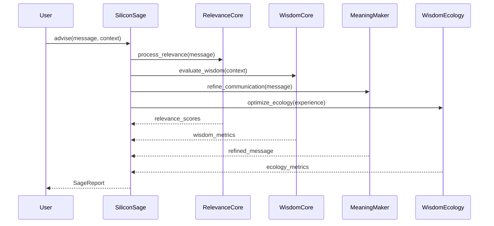
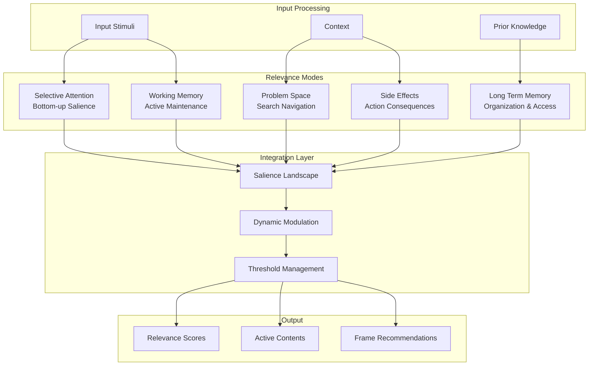
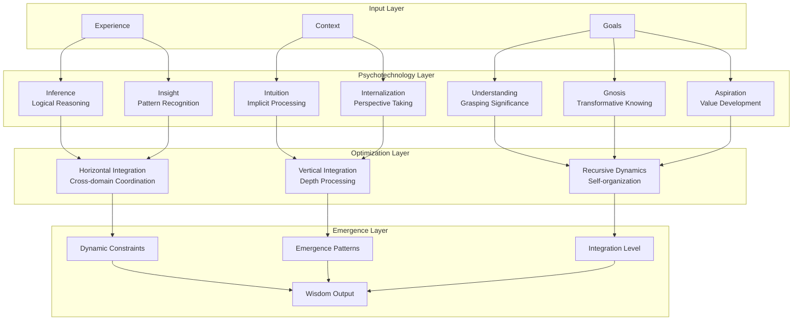
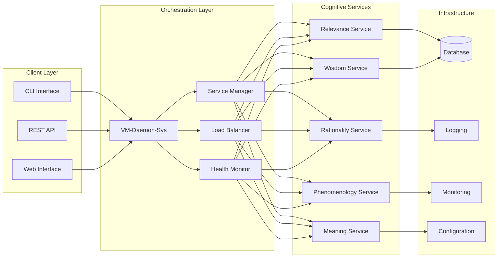
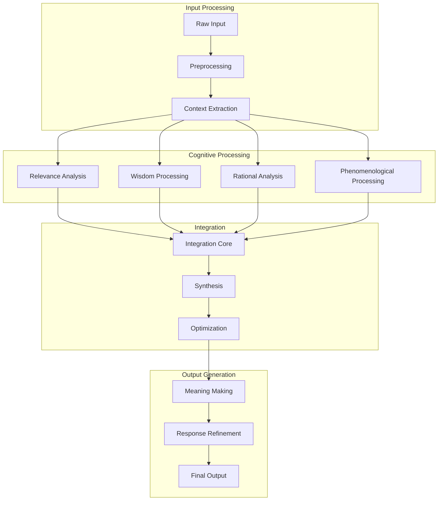

# Technical Architecture Documentation

## System Overview

CogPrime implements a sophisticated cognitive architecture based on John Vervaeke's research on relevance realization, wisdom, and the meaning crisis. The system integrates multiple cognitive frameworks to create adaptive, intelligent behavior.

## Core Architectural Patterns

### 1. Cognitive Orchestration Pattern

The SiliconSage class serves as the primary orchestrator, coordinating multiple cognitive cores:



### 2. Relevance Realization Architecture

The relevance system implements a multi-modal attention mechanism:



### 3. Wisdom Ecology Framework

The wisdom system coordinates multiple psychotechnologies:



## Service Architecture

### VM-Daemon-Sys Service Orchestration

The vm-daemon-sys provides distributed service management for cognitive components:



## Data Flow Architecture

### Processing Pipeline



## Module Specifications

### Core Modules

#### RelevanceCore
- **Purpose**: Implements relevance realization mechanisms
- **Key Methods**: 
  - `update_salience()`: Update salience weights for cognitive modes
  - `realize_relevance()`: Compute relevance scores for inputs
  - `manage_attention()`: Direct attention based on salience
- **Dependencies**: numpy, cognitive frameworks

#### WisdomEcology  
- **Purpose**: Coordinates psychotechnology ecosystem
- **Key Methods**:
  - `optimize_ecology()`: Balance psychotechnology usage
  - `update_constraints()`: Manage dynamic constraints
  - `measure_integration()`: Assess integration level
- **Dependencies**: WisdomCore, RationalityCore, CognitiveCore

#### SiliconSage
- **Purpose**: Main orchestrator and interface
- **Key Methods**:
  - `advise()`: Provide cognitive advice
  - `contemplate()`: Process experiences
  - `optimize_wisdom()`: Improve wisdom ecology
- **Dependencies**: All core modules

### Service Modules

#### VM-Daemon-Sys
- **Purpose**: Service orchestration and management
- **Key Methods**:
  - `start_services()`: Initialize cognitive services
  - `monitor_health()`: Track service status
  - `load_balance()`: Distribute processing load
- **Dependencies**: Service management frameworks

## Performance Characteristics

### Computational Complexity

| Module | Time Complexity | Space Complexity | Notes |
|--------|----------------|------------------|-------|
| RelevanceCore | O(n*m) | O(n+m) | n=inputs, m=modes |
| WisdomEcology | O(p²) | O(p) | p=psychotechnologies |
| Integration | O(k*log(k)) | O(k) | k=integration points |
| MeaningMaker | O(n) | O(n) | Linear in message length |

### Scalability Considerations

- **Horizontal Scaling**: VM-daemon-sys supports distributed processing
- **Vertical Scaling**: Core modules optimized for memory efficiency
- **Load Balancing**: Dynamic distribution based on processing requirements
- **Caching**: Relevance and wisdom computations cached where appropriate

## Configuration Management

### Environment Configuration

```yaml
# config/development.yml
cognitive:
  relevance:
    threshold: 0.5
    modes: ["selective_attention", "working_memory", "problem_space"]
  wisdom:
    psychotechnologies: ["inference", "insight", "intuition"]
    optimization_mode: "recursive"
  
services:
  daemon:
    port: 8080
    workers: 4
    health_check_interval: 30
  
logging:
  level: "INFO"
  format: "structured"
```

## Security Considerations

### Data Protection
- No sensitive data stored in cognitive states
- Ephemeral processing for user inputs
- Configurable data retention policies

### Service Security  
- Authentication for service endpoints
- Rate limiting for API access
- Input validation and sanitization

## Monitoring and Observability

### Metrics Collection
- Cognitive processing latency
- Relevance computation accuracy
- Wisdom integration effectiveness
- Service health and availability

### Logging Strategy
- Structured logging for all components
- Cognitive decision audit trails
- Performance and error tracking
- User interaction analytics

## Episode Analysis Integration

### Theoretical Foundation

CogPrime's architecture is deeply informed by John Vervaeke's research on relevance realization, wisdom, and the meaning crisis. Detailed analyses connecting specific episodes to implementation are available in the [episodes directory](episodes/README.md).

**Key Episode Insights Integrated:**
- **Meaning Crisis Framework**: Informs RelevanceCore and AletheiaCore design for detecting and addressing breakdown in meaning-making
- **Wisdom Ecology Principles**: Guides horizontal integration across multiple psychotechnologies
- **Transformative Learning**: Shapes recursive dynamics in cognitive processing
- **Collaborative Investigation**: Influences distributed processing architecture

See [Episode 00 Discussion](episodes/Episode_00_Discussion.md) for foundational analysis connecting the meaning crisis to CogPrime's architecture.

## Future Enhancements

### Planned Features
1. **Neural Integration**: Deep learning enhancement of cognitive modules
2. **Multi-Agent Systems**: Collaborative cognitive architectures
3. **Real-time Adaptation**: Dynamic parameter optimization
4. **Extended Phenomenology**: Richer experiential processing
5. **Meaning Crisis Detection**: Real-time relevance realization monitoring
6. **Wisdom Integration Pipeline**: Automated extraction from traditional sources

### Research Directions
1. **Cognitive Synergy**: Enhanced module interaction patterns
2. **Meaning Emergence**: Automatic meaning discovery mechanisms
3. **Wisdom Cultivation**: Learning-based wisdom enhancement
4. **Crisis Response**: Specialized meaning crisis intervention
5. **Bullshit Detection**: Advanced filtering of low-quality information
6. **Collaborative Reflection**: Framework for group cognitive processing